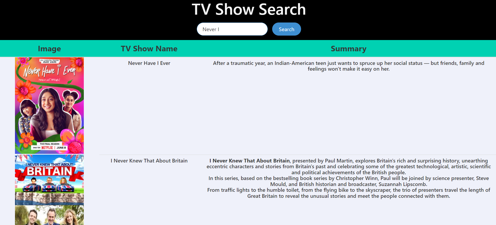

# TV Show Search App

This repository contains a TV Show Search App built with HTML, CSS (utilizing the Bulma framework), and JavaScript (with the Axios library) to fetch TV show data from the TVmaze.com API.

## Features

- Search for TV shows: Users can enter the name of a TV show they are interested in and retrieve relevant information.
- Display TV show details: The app fetches data from the TVmaze.com API and displays details such as the show's name, summary, rating, genre, and airtime.
- Responsive design: The app is designed to work seamlessly on various screen sizes, thanks to the responsive features of the Bulma framework.

## Technologies and Libraries Used

- HTML: The app's structure and layout are built using HTML.
- CSS (Bulma Framework): Bulma, a lightweight CSS framework, is utilized for responsive styling and layout.
- JavaScript: The app leverages JavaScript to handle user interactions and make HTTP requests to the TVmaze.com API.
- Axios Library: Axios is used to simplify the process of making HTTP requests and handling responses from the TVmaze.com API.

## Live Demo

[Try me!](https://shakeebparwez.github.io/tv-show-search-app/)

## Usage

1. Clone the repository: Clone this repository to your local machine using the `git clone` command.
2. Open the project: Navigate to the project's root directory.
3. Launch the app: Open the `index.html` file in your preferred web browser.
4. Search for TV shows: Enter the name of a TV show in the search bar and press the search button.
5. View results: The app will display relevant TV show information based on your search query.

## Acknowledgments

- [Colt Steele`s Web Developer Bootcamp](https://www.udemy.com/course/the-web-developer-bootcamp/)
- [tvmaze.com](https://www.tvmaze.com/api)
- [Axios](https://github.com/axios/axios)

Feel free to explore the codebase, modify it, and enhance the app's functionality to suit your needs.
